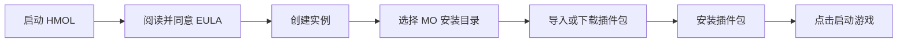

# 📘 使用说明

> 本章介绍 HMOL 启动器的主界面、基础操作与日常使用流程。

***

## 1. 界面总览

### 1.1 顶部导航

| 标签         | 功能                 |
| ---------- | ------------------ |
| 🏠 **首页**  | 当前实例信息、启动按钮、快捷操作   |
| 📦 **包管理** | 已安装/可安装的插件包、压缩包管理  |
| 🎮 **实例**  | 创建/编辑/删除/切换游戏实例    |
| ☁️ **联机**  | 微软账号登录、OneDrive 资源 |
| ⚙️ **设置**  | 主题、背景、字体、加密、安全选项   |
| ℹ️ **关于**  | 版本信息、EULA、许可证、致谢   |

***

## 2. 基础操作流程

### 2.1 第一次玩游戏(典型流程)

### 2.2 日常使用流程

1. **启动 HMOL** → 自动加载上次实例
2. **首页** → 确认当前实例正确
3. **(可选) 切换/管理实例** → 「🎮 实例」标签
4. **(可选) 安装新插件包** → 「📦 包管理」标签
5. **点击「▶ 启动游戏」**
6. **游玩** → 关闭游戏后返回启动器
7. **(可选) 备份/卸载** → 「🎮 实例」或「📦 包管理」

***

## 3. 实例管理

### 3.1 创建实例

**路径**: 「🎮 实例」→ 右上「➕ 新建实例」

| 字段   | 必填 | 说明                             |
| ---- | -- | ------------------------------ |
| 实例名称 | ✅  | 不能为空,不能与现有实例重名                 |
| 游戏路径 | ✅  | 必须包含 `Mental_Omega_client.exe` |
| 备注   | ❌  | 可选,仅显示用                        |

**校验失败时的提示**:

| 错误提示              | 原因      |
| ----------------- | ------- |
| 实例名称和路径不能为空       | 表单未填写完整 |
| 实例名称已存在           | 名称重复    |
| 指定路径不是有效的心灵终结游戏目录 | 路径无效    |
| 该游戏路径已被其他实例使用     | 路径冲突    |

### 3.2 切换实例

**路径**: 「🎮 实例」→ 列表中点击「切换」按钮

切换会自动:

- 保存当前实例的窗口大小
- 重新加载新实例的插件包列表
- 刷新已安装列表

### 3.3 重命名实例

**路径**: 「🎮 实例」→ 列表中点击「重命名」

- 新名称不能为空
- 新名称不能与现有实例重名
- **不影响** 实例目录结构

### 3.4 删除实例

**路径**: 「🎮 实例」→ 列表中点击「删除」

> ⚠️ **删除实例 = 删除实例配置,不会删除游戏本体文件**

会删除:

- `instances/<实例ID>/config.json` — 实例配置
- `instances/<实例ID>/install_record.json` — 安装记录

不会删除:

- 游戏目录(由实例配置中的 `path` 指向)

### 3.5 导出实例

**路径**: 「🎮 实例」→ 列表中点击「导出」

支持格式:

- `.zip` — 通用压缩包(默认)
- `.7z` — 高压缩比
- 通过 WinRAR 创建 `.zip` / `.rar`

***

## 4. 插件包管理

### 4.1 包类型

| 类型  | 扩展名                     | 安装位置                | 卸载方式      |
| --- | ----------------------- | ------------------- | --------- |
| 地图包 | `.map`                  | `游戏目录/Maps/Custom/` | 直接删除文件    |
| 资源包 | `.zip` / `.7z` / `.rar` | 解压到游戏根目录            | 精确卸载/全量恢复 |

> 📦 **本 Wiki 中统称「包」**,UI 文本中亦使用此词(避免与 mod/modification 混淆)。

### 4.2 安装插件包

**路径**: 「📦 包管理」→ 选择包 →「安装」

#### .map

- 直接复制到游戏根目录或 `Maps/Custom/`

#### 压缩包

1. 系统先解压到 `temp/install_<时间戳>/`
2. 自动检测「搬运许可.jpg」「说明.txt」并预览
3. 文件级冲突检测(同名文件时弹窗选择)
4. **文件级合并复制**(不会删除游戏根目录)
5. 写入 `install_record.json` 用于精确卸载

#### 冲突处理

安装时检测到目标已存在:

| 场景           | 弹窗选项           |
| ------------ | -------------- |
| 单文件冲突        | 「是/否」覆盖        |
| 目录冲突(无文件级冲突) | 「替换/取消」        |
| 目录冲突(有文件级冲突) | 「覆盖全部/跳过已有/取消」 |

### 4.3 卸载包

**路径**: 「📦 包管理」→「已安装」→ 选择包→「卸载」

#### 精确卸载(默认)

- 删除该包安装时新增的所有文件
- 还原被该包覆盖的原始文件(从 MO 备份)
- **不影响**其他包的文件

#### 全量恢复(回退方案)

- 当精确记录缺失时启用
- 删除游戏目录全部内容,从 MO 原版备份恢复
- ⚠️ **不可撤销**,会丢失未备份的所有游戏进度

### 4.4 删除本地包

**路径**: 「📦 包管理」→「本地包」→ 选择→「删除」

仅删除 `packages/` 目录下的源文件,**不影响**已安装到游戏中的内容。

***

## 5. 备份与恢复

### 5.1 创建备份

**路径**: 「🎮 实例」→ 当前实例→「💾 备份」

| 字段   | 说明                                        |
| ---- | ----------------------------------------- |
| 备份名称 | 必填,100 字符内,禁止 `< > : " / \ \| ? *` 与系统保留名 |
| 备份说明 | 可选                                        |

备份存储位置: `backups/<实例ID>/<备份名>/`

### 5.2 恢复备份

**路径**: 「🎮 实例」→ 当前实例→「📂 备份」→ 选择备份→「恢复」

- 二次确认(防止误操作)
- 进度条显示
- 完成后弹出恢复报告

### 5.3 删除备份

**路径**: 「🎮 实例」→ 当前实例→「📂 备份」→ 选择→「删除」

仅删除备份目录,**不影响**游戏目录。

***

## 6. OneDrive 

### 6.1 登录微软账号

**路径**: 「☁️ 联机」→「🔑 登录微软账号」

1. 点击「登录」
2. 弹出设备代码(device code)
3. 浏览器打开登录地址
4. 输入代码并登录
5. 启动器自动接收令牌
6. **重启启动器**完成登录

### 6.2 查看 OneDrive 资源

- 启动器内置多个 HMOL 资源分享链接
- 点击「浏览资源」即可访问
- 共享链接失效时弹出提示

### 6.3 退出登录

**路径**: 「☁️ 联机」→「退出登录」

会删除 `msal_token_cache.enc`(加密令牌)。

***

## 7. QQ 喊话

**路径**: 「🏠 首页」→ 右上角「📢 QQ 喊话」

### 7.1 输入规范

| 字段      | 必填 | 限制     |
| ------- | -- | ------ |
| MO 版本   | ✅  | ≤ 30 字 |
| 房间名字    | ✅  | ≤ 30 字 |
| 房间密码    | ❌  | ≤ 30 字 |
| HMOL 版本 | 自动 | —      |

### 7.2 内容限制

- ❌ 禁止任何 URL(http/https/[www./baidu.com](http://www./baidu.com) 等及混淆形式)
- ❌ 禁止侮辱性/脏话词汇
- ❌ 单条 ≤ 500 字
- ⚠️ 速率限制:5 次/分钟

### 7.3 发送目标

同时发送到:

- QQ 群

***

## 8. 设置

### 8.1 主题

| 主题   | 说明       |
| ---- | -------- |
| 深空蓝  | 默认,深色科技感 |
| 暮光紫  | 暗紫渐变     |
| 森林绿  | 护眼绿      |
| 烈焰红  | 暗红警示     |
| 海洋蓝  | 浅蓝清爽     |
| 经典深色 | 纯黑底      |

### 8.2 背景图片

- 支持格式: JPG / PNG / WEBP / AVIF
- 推荐分辨率: 1920×1080
- 大小限制: ≤ 10 MB
- 恢复默认:「恢复默认背景」

### 8.3 字体

- 跟随系统

### 8.4 加密

- **重新加密令牌**: 适用于机器码变更后无法读取旧令牌
- **清除所有加密数据**: 危险操作,需二次确认

***

## 10. 卸载

**详见** **[安装指南 → 卸载](HMOL-Installation-Guide#卸载)**

***

## 11. 常见使用问题

参见 [FAQ](HMOL-FAQ) 和 [故障排查](HMOL-Troubleshooting)。

***

**下一步**: [🧩 功能模块详解](HMOL-Features)
