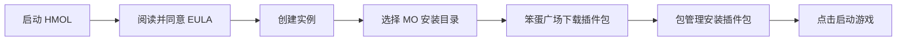

> 本章介绍 HMOL 启动器的主界面、基础操作与日常使用流程。

***

## 1. 界面总览

### 1.1 侧边栏导航

HMOL 采用**左侧边栏导航**,包含以下入口:

| 分区 | 入口 | 功能 |
| --- | --- | --- |
| 主导航 | 🏠 **主页** | 当前实例信息、启动按钮 |
| 主导航 | 👤 **账户与联机** | 微软账号登录、OneDrive 资源 |
| 心灵终结设置 | 🎮 **实例管理** | 创建/编辑/删除/切换/导出/导入游戏实例、备份/恢复 |
| 心灵终结设置 | 📦 **包管理** | 各类插件包(INI/地图/任务/语音/插件/美化/音乐)的安装/卸载 |
| 笨蛋广场 | 🎮 **游戏资源下载** | 9 类资源(INI/插件/地图/美化/任务/音乐/本体/实例/语音包)下载 |
| 笨蛋广场 | 🌐 **社区游戏资源下载** | 社区上传的游戏资源 |
| 笨蛋广场 | ⚙️ **运行环境** | 运行环境相关资源 |
| 笨蛋广场 | 🧩 **程序DLC下载** | 程序拓展 DLC 包下载 |
| 笨蛋广场 | 📤 **上传资源** | 上传社区游戏资源 / 创建并打包 DLC 上传社区 |
| 程序DLC | 🧩 **程序DLC** | 本地 DLC 管理(加载/刷新/打开文件夹) |
| 设置 | ⚙️ **设置** | 主题、背景、字体、音效、加密、安全选项 |
| 设置 | 📖 **使用教程** | 内置使用教程 |
| 设置 | 💬 **用户反馈** | 提交反馈 |
| 设置 | ℹ️ **关于** | 版本信息、EULA、QQ 群、检查更新 |
| 底部 | ❌ **退出** | 退出启动器 |

***

## 2. 基础操作流程

### 2.1 第一次玩游戏(典型流程)

### 2.2 日常使用流程

1. **启动 HMOL** → 自动加载上次实例
2. **首页** → 确认当前实例正确
3. **(可选) 切换/管理实例** → 「🎮 实例」标签
4. **(可选) 安装新插件包** → 「📦 包管理」标签
5. **点击「▶ 启动游戏」**
6. **游玩** → 关闭游戏后返回启动器
7. **(可选) 备份/卸载** → 「🎮 实例」或「📦 包管理」

***

## 3. 实例管理

### 3.1 创建实例

**路径**: 「🎮 实例」→ 右上「➕ 新建实例」

| 字段   | 必填 | 说明                             |
| ---- | -- | ------------------------------ |
| 实例名称 | ✅  | 不能为空,不能与现有实例重名                 |
| 游戏路径 | ✅  | 必须包含 `Mental_Omega_client.exe` |
| 备注   | ❌  | 可选,仅显示用                        |

**校验失败时的提示**:

| 错误提示              | 原因      |
| ----------------- | ------- |
| 实例名称和路径不能为空       | 表单未填写完整 |
| 实例名称已存在           | 名称重复    |
| 指定路径不是有效的心灵终结游戏目录 | 路径无效    |
| 该游戏路径已被其他实例使用     | 路径冲突    |

### 3.2 切换实例

**路径**: 「🎮 实例」→ 列表中点击「切换」按钮

切换会自动:

- 保存当前实例的窗口大小
- 重新加载新实例的插件包列表
- 刷新已安装列表

### 3.3 重命名实例

**路径**: 「🎮 实例」→ 列表中点击「重命名」

- 新名称不能为空
- 新名称不能与现有实例重名
- **不影响** 实例目录结构

### 3.4 删除实例

**路径**: 「🎮 实例」→ 列表中点击「删除」

> ⚠️ **删除实例 = 删除实例配置,不会删除游戏本体文件**

会删除:

- `instances/<实例ID>/config.json` — 实例配置
- `instances/<实例ID>/install_record.json` — 安装记录

不会删除:

- 游戏目录(由实例配置中的 `path` 指向)

### 3.5 导出实例

**路径**: 「🎮 实例」→ 列表中点击「导出」

支持格式:

- `.zip` — 通用压缩包(默认)
- `.7z` — 高压缩比
- 通过 WinRAR 创建 `.zip` / `.rar`

### 3.6 导入实例

**路径**: 「🎮 实例管理」→「📥 导入」

- 选择之前导出的实例包(`.zip` / `.7z` / `.rar`)即可恢复
- 导入前可点击「📋 预览导出配置」查看实例包内的配置信息

### 3.7 备份游戏

**路径**: 「🎮 实例管理」→ 底部按钮

- **💾 备份游戏** — 备份当前实例的游戏文件
- **🗂️ 备份原版** — 备份 MO 原版文件(用于精确卸载/全量恢复的还原依据)
- **♻️ 恢复游戏** — 从备份恢复
- **📁 打开目录** — 打开游戏目录

***

## 4. 插件包管理

### 4.1 包类型

包管理页按类型分为 **7 个 Tab**,每个 Tab 对应一种资源分类:

| Tab | 扩展名 | 安装位置 | 卸载方式 |
| --- | --- | --- | --- |
| 📝 INI包 | `.ini` 相关 | 游戏根目录 | 精确卸载 |
| 🗺️ 地图包 | `.map` | 游戏目录/Maps/Custom/ | 直接删除文件 |
| 📋 任务包 | 任务文件 | 游戏根目录 | 精确卸载 |
| 🎤 语音包 | 语音资源 | 游戏根目录 | 精确卸载 |
| 🧩 插件包 | `.zip` / `.7z` / `.rar` | 解压到游戏根目录 | 精确卸载/全量恢复 |
| 🎨 美化包 | 美化资源 | 游戏根目录 | 精确卸载 |
| 🎵 音乐包 | 音乐资源 | 游戏根目录 | 精确卸载 |

> 📦 **本 Wiki 中统称「包」**,UI 文本中亦使用此词(避免与 mod/modification 混淆)。

每个 Tab 提供按钮:「🚀 安装」「🗑️ 移除」「🗑️ 卸载」「⬇️ 下载」「📥 导入」「📁 目录」「🔄 刷新」。

- **⬇️ 下载** — 跳转到「笨蛋广场 → 游戏资源下载」对应类别
- **📥 导入** — 导入本地压缩包到可用包列表
- 左侧「📦 可用包」列表,双击安装;右侧「✅ 已安装」列表,双击卸载

### 4.2 安装插件包

**路径**: 「📦 包管理」→ 选择包 →「安装」

#### .map

- 直接复制到游戏根目录或 `Maps/Custom/`

#### 压缩包

1. 系统先解压到 `temp/install_<时间戳>/`
2. 自动检测「搬运许可.jpg」「说明.txt」并预览
3. 文件级冲突检测(同名文件时弹窗选择)
4. **文件级合并复制**(不会删除游戏根目录)
5. 写入 `install_record.json` 用于精确卸载

#### 冲突处理

安装时检测到目标已存在:

| 场景           | 弹窗选项           |
| ------------ | -------------- |
| 单文件冲突        | 「是/否」覆盖        |
| 目录冲突(无文件级冲突) | 「替换/取消」        |
| 目录冲突(有文件级冲突) | 「覆盖全部/跳过已有/取消」 |

### 4.3 卸载包

**路径**: 「📦 包管理」→「已安装」→ 选择包→「卸载」

#### 精确卸载(默认)

- 删除该包安装时新增的所有文件
- 还原被该包覆盖的原始文件(从 MO 备份)
- **不影响**其他包的文件

#### 全量恢复(回退方案)

- 当精确记录缺失时启用
- 删除游戏目录全部内容,从 MO 原版备份恢复
- ⚠️ **不可撤销**,会丢失未备份的所有游戏进度

### 4.4 删除本地包

**路径**: 「📦 包管理」→「本地包」→ 选择→「删除」

仅删除 `packages/` 目录下的源文件,**不影响**已安装到游戏中的内容。

***

## 5. 备份与恢复

### 5.1 创建备份

**路径**: 「🎮 实例」→ 当前实例→「💾 备份」

| 字段   | 说明                                        |
| ---- | ----------------------------------------- |
| 备份名称 | 必填,100 字符内,禁止 `< > : " / \ \| ? *` 与系统保留名 |
| 备份说明 | 可选                                        |

备份存储位置: `backups/<实例ID>/<备份名>/`

### 5.2 恢复备份

**路径**: 「🎮 实例」→ 当前实例→「📂 备份」→ 选择备份→「恢复」

- 二次确认(防止误操作)
- 进度条显示
- 完成后弹出恢复报告

### 5.3 删除备份

**路径**: 「🎮 实例」→ 当前实例→「📂 备份」→ 选择→「删除」

仅删除备份目录,**不影响**游戏目录。

***

## 6. OneDrive 

### 6.1 登录微软账号

**路径**: 「☁️ 联机」→「🔑 登录微软账号」

1. 点击「登录」
2. 弹出设备代码(device code)
3. 浏览器打开登录地址
4. 输入代码并登录
5. 启动器自动接收令牌
6. **重启启动器**完成登录

### 6.2 查看 OneDrive 资源

- 启动器内置多个 HMOL 资源分享链接
- 点击「浏览资源」即可访问
- 共享链接失效时弹出提示

### 6.3 下载文件(前台/后台)

点击文件行的「下载」按钮(或 DLC 页的「下载」)后:

1. 弹出**下载确认窗**,显示文件名、大小、保存位置
2. 选择下载方式:
   - **「⬇ 下载」(默认)** — 前台下载,显示模态进度窗口(带取消按钮),完成后弹出完成提示
   - **「⬇ 后台下载」** — 转入右下角无边框悬浮窗,实时显示进度条/速度/剩余时间,期间可正常使用启动器其他功能;完成后自动淡出,可随时取消
3. 退出启动器时自动停止下载,已下载部分保留

#### 断点续传

- 下载中断/取消/失败后,已下载内容保存在 `.part` 临时文件中
- 再次下载同一文件时,弹窗显示已下载百分比并询问**是否从断点继续**
- 选择「是」直接续传,选择「否」则删除临时文件重新下载

#### 其他说明

- 大文件(≥64MB)使用多线程分片并发下载(最高 16 连接),速度大幅提升
- 下载前自动检查磁盘剩余空间,不足时提示并中止
- 下载失败会弹窗询问是否重试,重试自动续传并保持原下载方式

### 6.4 退出登录

**路径**: 「☁️ 联机」→「退出登录」

会删除 `msal_token_cache.enc`(加密令牌)。

***

## 7. 笨蛋广场(资源下载)

侧边栏「🤡 笨蛋广场」分区提供多个资源下载入口。

### 7.1 游戏资源下载

**路径**: 「🤡 笨蛋广场」→「🎮 游戏资源下载」

类别选择页共 **9 类**资源,点击类别卡片进入文件列表:

| 类别 | 说明 |
| --- | --- |
| 📝 INI包 | 配置类资源 |
| 🧩 插件包 | 游戏插件 |
| 🗺️ 地图包 | 对战/任务地图 |
| 🎨 美化包 | 界面/视觉美化 |
| 📋 任务包 | 任务关卡 |
| 🎵 音乐包 | 背景音乐 |
| 🎮 游戏本体 | MO 游戏本体 |
| 🖥️ 游戏实例 | 完整游戏实例 |
| 🎤 语音包 | 语音资源 |

进入文件列表后,点击「⬇ 下载」按 [第 6.3 节](#63-下载文件前台后台) 的流程下载。

### 7.2 社区游戏资源下载

**路径**: 「🤡 笨蛋广场」→「🌐 社区游戏资源下载」

链接指向社区上传的游戏资源文件夹,可浏览社区成员共享的资源。

### 7.3 运行环境

**路径**: 「🤡 笨蛋广场」→「⚙️ 运行环境」

提供运行环境相关的资源下载(如运行库等)。

### 7.4 下载线路选择

浏览资源时,若该资源在多个网盘均有镜像,点击「在浏览器中查看」会弹出「🌐 选择下载线路」:

- OneDrive
- 123云盘(123pan.cn)
- 百度网盘(pan.baidu.com)
- 移动云盘(yun.139.com)

选择线路后在浏览器中打开对应镜像。

### 7.5 上传资源

**路径**: 「🤡 笨蛋广场」→「📤 上传资源」

弹窗提供两个入口:

- **📦 上传社区游戏资源** — 用浏览器打开社区上传页
- **🧩 上传社区DLC资源** — 打开 DLC 打包向导(见 [第 8 章](#8-程序dlc))

***

## 8. 程序DLC

### 8.1 什么是 DLC

**程序DLC**是扩展启动器功能的模块化拓展包,与游戏资源「插件包」是两套完全独立的体系。每个 DLC 是一个包含 `DLC.json` 清单文件的文件夹,放入启动器的 `DLC/` 目录后自动加载。

### 8.2 本地 DLC 管理

**路径**: 侧边栏「🧩 程序DLC」

- **🔄 刷新列表** — 重新扫描 DLC 文件夹
- **📂 打开 DLC 文件夹** — 打开 `启动器目录/DLC/`
- 左侧「📑 目录」导航,右侧本地 DLC 列表
- 将含 `DLC.json` 的文件夹放入 `DLC/` 目录后**自动加载**(无需手动刷新)

### 8.3 创建 DLC

**路径**: 「🤡 笨蛋广场」→「📤 上传资源」→「🧩 上传社区DLC资源」

打开 **DLC 打包向导**:

1. 填写表单: **DLC类型**、**DLC名称**、**DLC目录名** 等
2. 「📁 生成骨架到本地 DLC」— 在 DLC 目录生成目录骨架与 `DLC.json`
3. 或直接「🌐 上传到社区」— 打包后在浏览器打开社区上传页

### 8.4 DLC.json 规范

**路径**: 「⚙️ 设置」→ 程序拓展(DLC)卡片 →「📋 查看 DLC.json 规范」

可查看完整的 `DLC.json` 字段说明与示例。

### 8.5 DLC 下载与安装

- **下载**: 「🤡 笨蛋广场」→「🧩 程序DLC下载」,按 [第 6.3 节](#63-下载文件前台后台) 的流程下载
- **安装**: DLC 包下载完成后**自动解压安装**到 DLC 目录
- **生效**: 安装完成后需**重启启动器**才能加载新内容

***

## 9. QQ 喊话

**路径**: 「🏠 首页」→ 右上角「📢 QQ 喊话」

### 9.1 输入规范

| 字段      | 必填 | 限制     |
| ------- | -- | ------ |
| MO 版本   | ✅  | ≤ 30 字 |
| 房间名字    | ✅  | ≤ 30 字 |
| 房间密码    | ❌  | ≤ 30 字 |
| HMOL 版本 | 自动 | —      |

### 7.2 内容限制

- ❌ 禁止任何 URL(http/https/[www./baidu.com](http://www./baidu.com) 等及混淆形式)
- ❌ 禁止侮辱性/脏话词汇
- ❌ 单条 ≤ 500 字
- ⚠️ 速率限制:5 次/分钟

### 9.3 发送目标

同时发送到:

- QQ 群

***

## 10. 设置

### 10.1 主题

| 主题 | 说明 |
| --- | --- |
| 🔵 蓝紫渐变 | 默认,深色科技感 |
| 🌊 蓝青渐变 | 蓝青过渡 |
| 🌅 橘红渐变 | 暖色渐变 |
| 🌲 森林绿渐变 | 护眼绿 |
| 🌸 玫瑰粉渐变 | 粉色系 |
| 🌌 暮光紫渐变 | 暗紫渐变 |

另附 3 套「雾感弥散光色板」:🌊 Flow Shade、🎀 Gentle Radiance、🍃 Fresh Aura。

支持主题模式三选一:**浅色模式 / 深色模式 / 跟随系统**。

### 10.2 背景图片

- 支持格式: JPG / PNG / GIF / WEBP / MP4 / WebM / AVIF 等
- 支持 **Wallpaper 壁纸包(.mpkg)**:导入 Wallpaper Engine 导出的壁纸包,程序自动解包提取视频/图片作为背景
- 推荐分辨率: 1920×1080
- 恢复默认:「恢复默认背景」

### 10.3 字体

- 跟随系统

### 10.4 加密

- **重新加密令牌**: 适用于机器码变更后无法读取旧令牌
- **清除所有加密数据**: 危险操作,需二次确认

### 10.5 音效(BGM 播放列表)

- **🎵 添加音乐文件** — 添加本地音乐到播放列表
- **🗑 移除选中**、**⏮ Prev / ⏯ Play-Pause / ⏭ Next / ⏹ Stop**
- **🔀 随机播放**、音量滑条

### 10.6 程序拓展(DLC)

设置页「🧩 程序拓展(DLC)」卡片提供:

- **📋 查看 DLC.json 规范** — 查看完整规范与示例
- **🔄 刷新列表** — 重新扫描 DLC 文件夹
- **📂 打开 DLC 文件夹**

***

## 11. 在线更新

### 11.1 自动检查

- 启动 3 秒后静默检查更新(24 小时内只检查一次)
- 发现新版本时自动弹出更新对话框

### 11.2 手动检查

**路径**: 「ℹ️ 关于」→「🔄 检查更新」,或设置页的「🔄 检查更新」

### 11.3 更新对话框

- 显示版本对比:「当前: vX → 最新: vY (大小)」与更新内容
- **下载线路**: 可切换 GitHub 线路(切换后重新检查清单)
- 大版本更新显示强制更新警告(「⚠️ 大版本更新…必须升级」)
- 下载进度: 进度条、已下载/总大小、剩余时间、速度
- 按钮: 立即更新 / 稍后 / 最小化;下载完成后「立即重启」或「稍后重启」
- 更新失败可「重试」

***

## 12. 关于

**路径**: 侧边栏「ℹ️ 关于」

- 版本信息(当前版本 v3.2.0)、作者
- **📞 联系我们**: 官方 QQ 1群(1034243331)、QQ 2群(1092671790),支持一键复制群号与一键加群
- **GitHub 仓库 / Releases** 链接
- **📜 查看使用协议** — 查看 EULA
- **🔄 检查更新**

***

## 13. 卸载

**详见** **[FAQ → 怎么彻底卸载](/standard/faq#q-怎么彻底卸载)**

***

## 14. 常见使用问题

参见 [FAQ](/standard/faq) 和 [故障排查](/standard/troubleshooting)。

***
